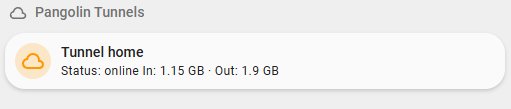
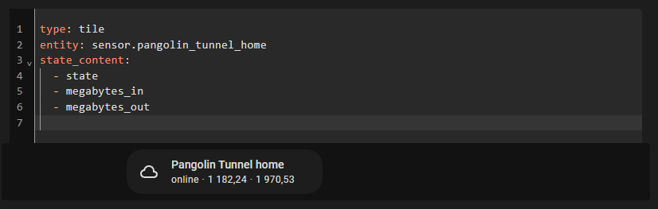

# Pangolin Monitor Integration for Home Assistant


This integration connects Home Assistant with [Pangolin](https://github.com/fosrl/pangolin)  



Previously I used Cloudflare Zero Trust Tunnel and after switching to Pangolin I realized that I lacked monitoring, and so I decided to quickly make an addon for monitoring the status of my tunnels.  
I will be glad to receive suggestions for new functionality.  
## Features

- Authenticate using email and password
- Tracks tunnels/sites registered in Pangolin
- Displays state (online/offline) and stats per tunnel

## Pre-Reqs
1. A admin user in Pangolin (normal user wont poll tunnel statuses).
2. HACS installed on Home Assistant.
3. You have [mushroom cards](https://github.com/piitaya/lovelace-mushroom) installed too (optional)

## Configuration

1. Go to Home Assistant HACS
2. Click the three dots in the top right, Custom Repositories.
3. Paste the URL for this repo into the Repository box, change the type to 'Integrations, and Press Add
4. Go to Integrations
5. Add new integration -> Pangolin Monitor
6. Provide your Pangolin email, password, and server base URL

If you are using mushroom cards, you can use the Jinja Generator script below to generate cards for all your tunnels at once. Or you can use the built-in "Tile" component or any other component you prefer.


```yaml
type: tile
entity: sensor.pangolin_tunnel_home
state_content:
  - state
  - megabytes_in
  - megabytes_out
```

## Jinja Generator script for mushroom template cards
_Important: Ensure that your tunnels are setup/viewable before doing this part._  

### 🔧 How to use
1. Go to Home Assistant → Developer Tools → Templates.
2. Paste the Jinja code below and copy the generated YAML to your clipboard.
```jinja

- type: custom:mushroom-template-card
  primary: Tunnel {{ entity.attributes.name or entity.entity_id.split('_')[-1] }}
  secondary: >
    Status: {{ '{{ states("' ~ entity.entity_id ~ '") }}' }}
    In: {{ '{{ (state_attr("' ~ entity.entity_id ~ '", "megabytes_in") / 1024) | round(2) }} GB ·
    Out: {{ (state_attr("' ~ entity.entity_id ~ '", "megabytes_out") / 1024) | round(2) }} GB' }}
  icon: mdi:cloud-outline
  icon_color: orange
  entity: {{ entity.entity_id }}
  layout: horizontal
  tap_action:
    action: more-info

```
3. Go to your dashboard of choice, edit and create a new card as a "Manual Card" (or into a vertical-stack if there are multiple cards).
4. Paste in the generated code, then add the below to the top of the code -
```yaml
type: vertical-stack
cards:
```
_Note, make sure to indent the pasted code._

## Disclaimer
This project is not affiliated with or endorsed by Pangolin.
